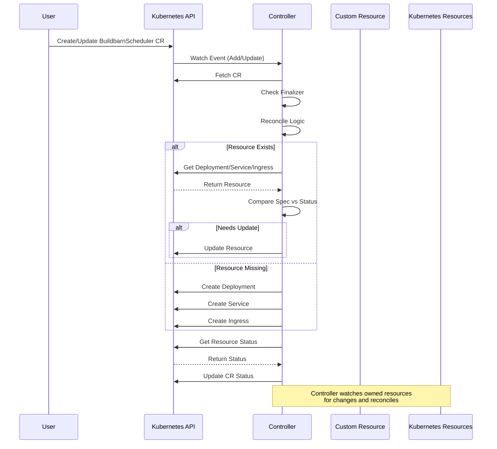
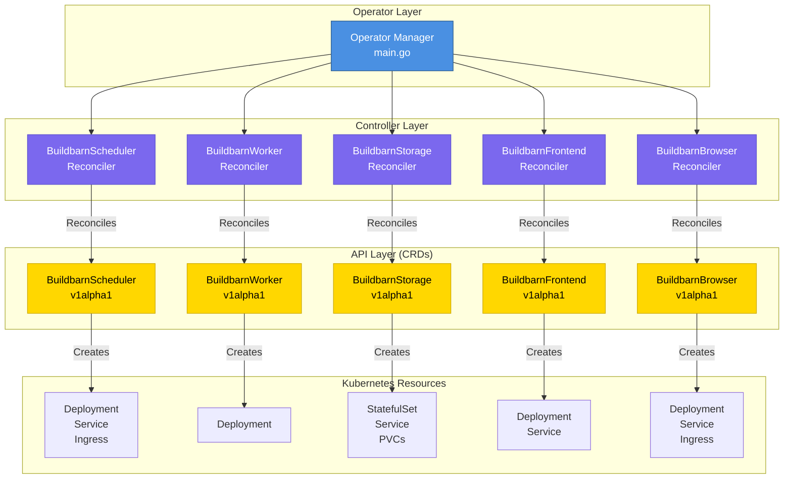
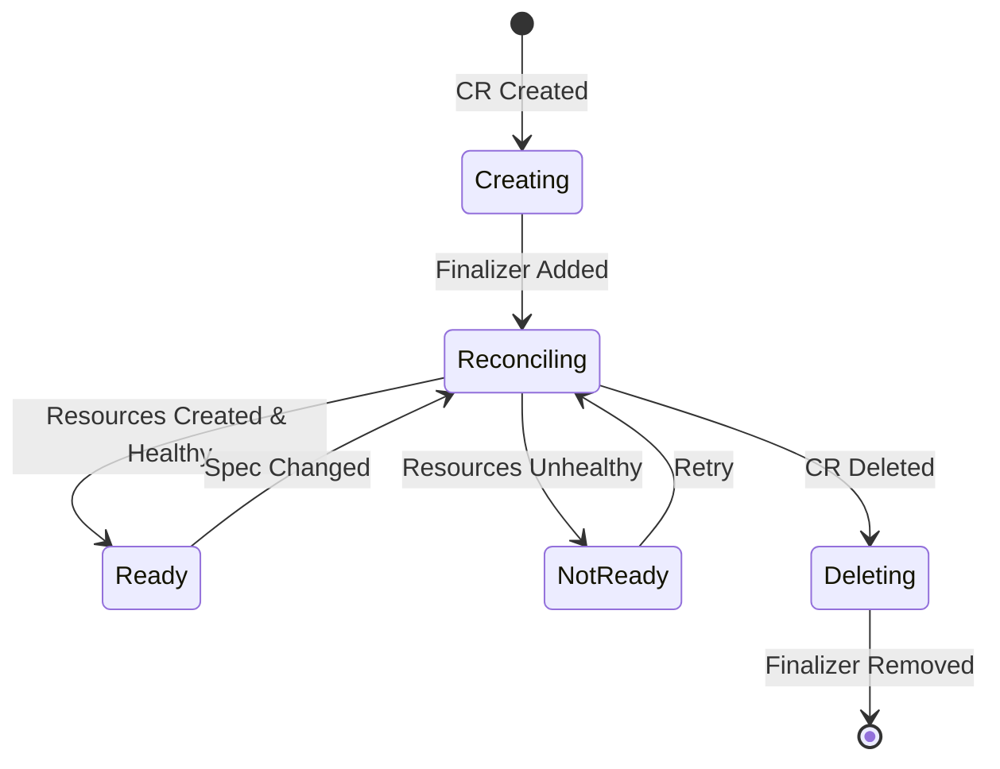

# Buildbarn Operator Architecture

## Overview

This document describes the architecture, flow, and hierarchy of the Buildbarn Kubernetes Operator.

## Architecture Diagram

```mermaid
graph TB
    subgraph "Kubernetes Cluster"
        subgraph "Operator Namespace (buildbarn-system)"
            Manager[Operator Manager<br/>controller-runtime]
            Manager -->|Manages| SchedulerCtrl[BuildbarnScheduler Controller]
            Manager -->|Manages| WorkerCtrl[BuildbarnWorker Controller]
            Manager -->|Manages| StorageCtrl[BuildbarnStorage Controller]
            Manager -->|Manages| FrontendCtrl[BuildbarnFrontend Controller]
            Manager -->|Manages| BrowserCtrl[BuildbarnBrowser Controller]
        end

        subgraph "Application Namespace (buildbarn)"
            subgraph "Custom Resources"
                SchedulerCR[BuildbarnScheduler CR]
                WorkerCR[BuildbarnWorker CR]
                StorageCR[BuildbarnStorage CR]
                FrontendCR[BuildbarnFrontend CR]
                BrowserCR[BuildbarnBrowser CR]
            end

            subgraph "Kubernetes Resources"
                SchedulerDeploy[Deployment: scheduler]
                SchedulerSvc[Service: scheduler]
                SchedulerIng[Ingress: scheduler]
                
                WorkerDeploy[Deployment: worker]
                
                StorageSTS[StatefulSet: storage]
                StorageSvc[Service: storage]
                
                FrontendDeploy[Deployment: frontend]
                FrontendSvc[Service: frontend]
                
                BrowserDeploy[Deployment: browser]
                BrowserSvc[Service: browser]
                BrowserIng[Ingress: browser]
            end

            ConfigMap[ConfigMap: buildbarn-config]
        end
    end

    SchedulerCtrl -->|Watches & Reconciles| SchedulerCR
    SchedulerCR -->|Creates| SchedulerDeploy
    SchedulerCR -->|Creates| SchedulerSvc
    SchedulerCR -->|Creates| SchedulerIng
    SchedulerDeploy -->|Mounts| ConfigMap

    WorkerCtrl -->|Watches & Reconciles| WorkerCR
    WorkerCR -->|Creates| WorkerDeploy
    WorkerDeploy -->|Mounts| ConfigMap

    StorageCtrl -->|Watches & Reconciles| StorageCR
    StorageCR -->|Creates| StorageSTS
    StorageCR -->|Creates| StorageSvc
    StorageSTS -->|Mounts| ConfigMap
    StorageSTS -->|Uses| PVC[PersistentVolumeClaims]

    FrontendCtrl -->|Watches & Reconciles| FrontendCR
    FrontendCR -->|Creates| FrontendDeploy
    FrontendCR -->|Creates| FrontendSvc
    FrontendDeploy -->|Mounts| ConfigMap

    BrowserCtrl -->|Watches & Reconciles| BrowserCR
    BrowserCR -->|Creates| BrowserDeploy
    BrowserCR -->|Creates| BrowserSvc
    BrowserCR -->|Creates| BrowserIng
    BrowserDeploy -->|Mounts| ConfigMap

    style Manager fill:#4a90e2,stroke:#2e5c8a,color:#fff
    style SchedulerCtrl fill:#7b68ee,stroke:#5a4fcf,color:#fff
    style WorkerCtrl fill:#7b68ee,stroke:#5a4fcf,color:#fff
    style StorageCtrl fill:#7b68ee,stroke:#5a4fcf,color:#fff
    style FrontendCtrl fill:#7b68ee,stroke:#5a4fcf,color:#fff
    style BrowserCtrl fill:#7b68ee,stroke:#5a4fcf,color:#fff
    style SchedulerCR fill:#ffd700,stroke:#ccaa00,color:#000
    style WorkerCR fill:#ffd700,stroke:#ccaa00,color:#000
    style StorageCR fill:#ffd700,stroke:#ccaa00,color:#000
    style FrontendCR fill:#ffd700,stroke:#ccaa00,color:#000
    style BrowserCR fill:#ffd700,stroke:#ccaa00,color:#000
```



## Reconciliation Flow



## Component Hierarchy



## Controller Responsibilities

### BuildbarnScheduler Controller
- **Manages**: Deployment, Service, Ingress
- **Ports**: 8982 (client-grpc), 8983 (worker-grpc), 7982 (http)
- **Default Replicas**: 1
- **Service Type**: ClusterIP

### BuildbarnWorker Controller
- **Manages**: Deployment (with init containers and sidecars)
- **Components**: 
  - Worker container (bb-worker)
  - Runner container (runner sidecar)
  - Runner installer init container
  - Volume init container
- **Default Replicas**: 8
- **Instance**: Supports multiple instances (e.g., ubuntu22-04)

### BuildbarnStorage Controller
- **Manages**: StatefulSet, Service, PersistentVolumeClaims
- **Ports**: 8981 (grpc)
- **Default Replicas**: 2
- **Storage**: 
  - CAS: 33Gi (default)
  - AC: 1Gi (default)
- **Service Type**: Headless (ClusterIP: None)

### BuildbarnFrontend Controller
- **Manages**: Deployment, Service
- **Ports**: 8980 (grpc)
- **Default Replicas**: 3
- **Service Type**: LoadBalancer

### BuildbarnBrowser Controller
- **Manages**: Deployment, Service, Ingress
- **Ports**: 7984 (http)
- **Default Replicas**: 3
- **Service Type**: ClusterIP
- **Ingress**: Optional (created if IngressHost specified)

## Lifecycle Management



## Key Features

1. **Finalizers**: All controllers use finalizers to ensure proper cleanup
2. **Owner References**: All created resources have owner references to the CR
3. **Status Updates**: Controllers update CR status based on underlying resource states
4. **Watch**: Controllers watch both CRs and owned resources for changes
5. **Reconciliation**: Continuous reconciliation loop ensures desired state

## Resource Dependencies

```
ConfigMap (buildbarn-config)
    ├── Common configuration (common.libsonnet)
    ├── Scheduler configuration (scheduler.jsonnet)
    ├── Worker configuration (worker-{instance}.jsonnet)
    ├── Runner configuration (runner-{instance}.jsonnet)
    ├── Storage configuration (storage.jsonnet)
    ├── Frontend configuration (frontend.jsonnet)
    └── Browser configuration (browser.jsonnet)
```

All components mount the ConfigMap to `/config/` directory in their containers.
